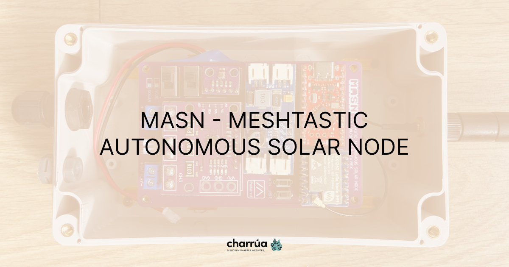
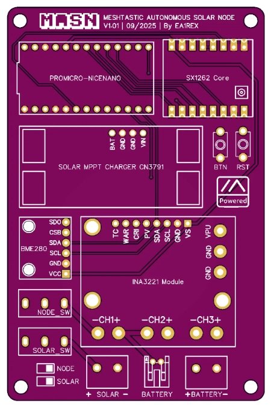

# MASN: Solar Meshtastic Node DIY

## Overview

MASN is a solar-powered Meshtastic node designed for anyone to build easily. This repository provides downloadable 3D model and PCB design to help you assemble your own device. The project aims to make decentralized, solar-powered communication accessible and open.

## Features

- [3D printable enclosure adaptor](3D/masn-box-adaptor.stl)
- [PCB design files for easy manufacturing](pcb/core-1262/masn-core-1262.zip)
- Open hardware and open documentation
- Easy to replicate and customize

  

## Full Documentation & Article

For detailed instructions, photos, and the full story behind the project, read the original article:

- 🇬🇧 English (soon)
- 🇪🇸 [MASN: un nodo solar Meshtastic que cualquiera puede montar](https://danielpcostas.dev/es/masn-nodo-solar-meshtastic-que-cualquiera-puede-montar/)

## Contributing

If you want to contribute to this project, please fork the repository, create a new branch, and submit a pull request. Contributions are welcome!

## License

This project is licensed under the CERN Open Hardware Licence Version 2 - Strongly Reciprocal (CERN-OHL-S v2).

This license allows you to:

- **Use** the hardware design for any purpose
- **Study** how the hardware works
- **Modify** the design to suit your needs
- **Share** copies of the original or modified design

The "Strongly Reciprocal" condition means that if you distribute products based on this design, you must also share any modifications under the same license, ensuring the hardware remains open.

## Disclaimer

This project is shared as-is, without warranty. Each person is responsible for assembling and using their own node. If you decide to deploy it, make sure you comply with your local radio regulations.
