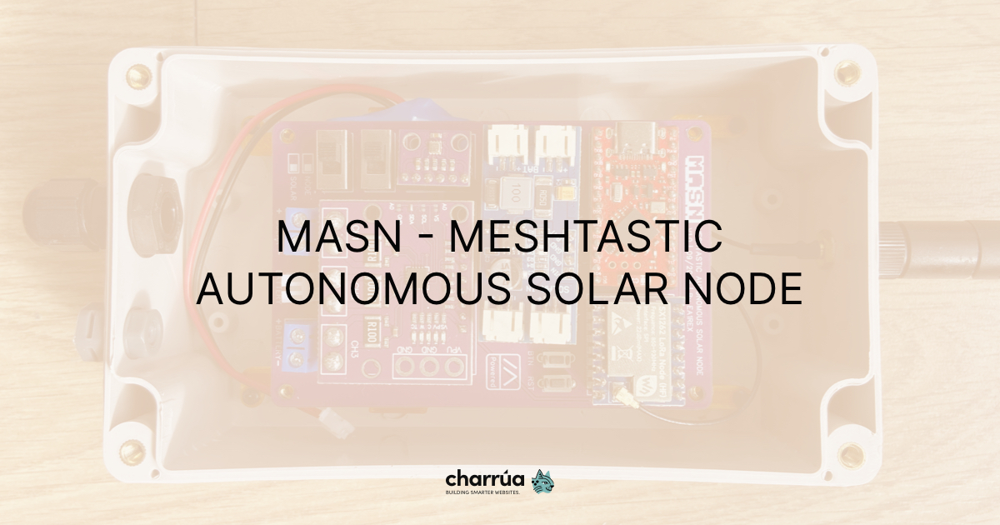
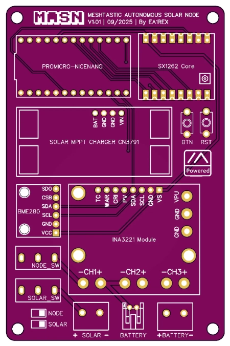
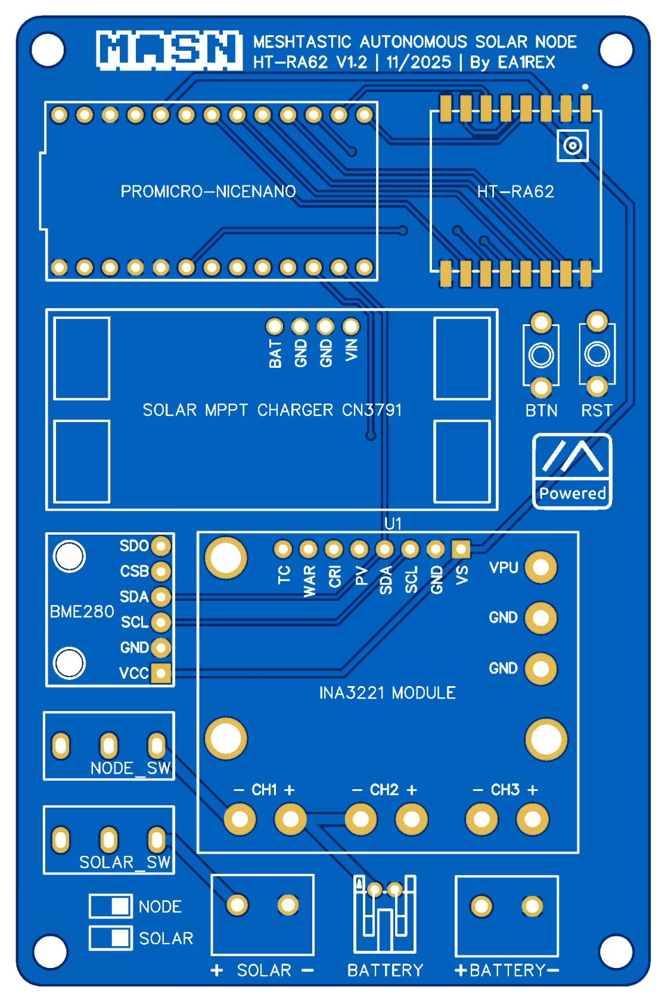
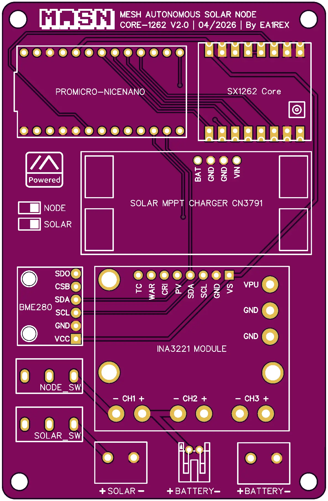
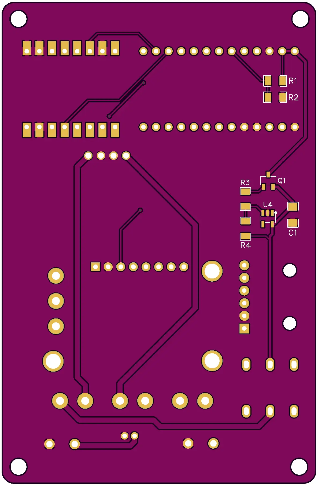
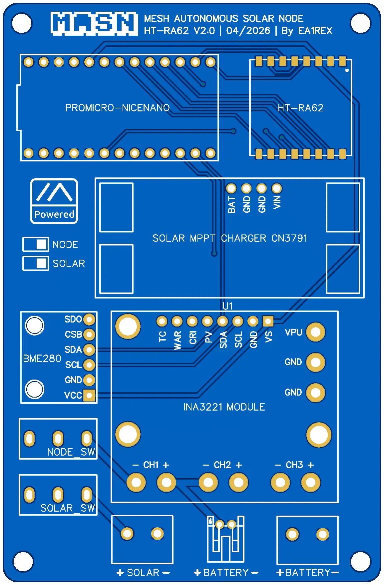
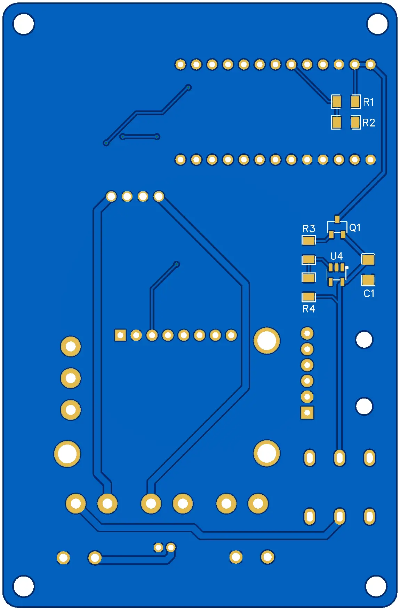

# MASN: Solar Meshtastic Node DIY

## Overview

MASN is a solar-powered Meshtastic node designed for anyone to build easily. This repository provides downloadable 3D model and PCB design to help you assemble your own device. The project aims to make decentralized, solar-powered communication accessible and open.

## Features

- [3D printable enclosure adaptor](3D/masn-box-adaptor.stl)
- Open hardware and open documentation
- Easy to replicate and customize

### PCB versions

MASN comes in two generations, each available for two LoRa modules:

**MASN V1** — through-hole (THT) components only. The simplest build, recommended for a first node, learning or testing.

- **Core-1262**: [PCB files](pcb/core-1262/Gerber_masn-core-1262.zip) | [Schematic](pcb/core-1262/Schematic_masn-core-1262.pdf) (Waveshare Core-1262 module)
- **HT-RA62**: [PCB files](pcb/ht-ra62/Gerber_masn-ht-ra62.zip) | [Schematic](pcb/ht-ra62/Schematic_masn-ht-ra62.pdf) (HT-RA62 module - same as Faketec)

  
  

  <em>V1 — Core-1262 version (left) and HT-RA62 version (right)</em>

**MASN V2.0** — adds battery-level reading in Meshtastic and a voltage supervisor for clean recovery after a full discharge. Includes some SMD components (moderate difficulty), best suited for outdoor or remote installations.

- **Core-1262**: [PCB files](pcb/v2/core-1262/Gerber_masn-v2-core-1262.zip) | [Schematic](pcb/v2/core-1262/Schematic_masn-v2-core-1262.pdf) (Waveshare Core-1262 module)
- **HT-RA62**: [PCB files](pcb/v2/ht-ra62/Gerber_masn-v2-htra62.zip) | [Schematic](pcb/v2/ht-ra62/Schematic_masn-v2-htra62.pdf) (HT-RA62 module - same as Faketec)

  
  

  <em>V2.0 Core-1262 — front (left) and back (right)</em>

  
  

  <em>V2.0 HT-RA62 — front (left) and back (right)</em>

## Full Documentation & Article

For detailed instructions, photos, and the full story behind the project, read the original articles:

### MASN V1

- [🇬🇧 MASN: A Simple and Open-Source Solar Node for Meshtastic](https://danielpcostas.dev/masn-a-simple-and-open-source-solar-node-for-meshtastic/)
- [🇪🇸 MASN: un nodo solar Meshtastic que cualquiera puede montar](https://danielpcostas.dev/es/masn-nodo-solar-meshtastic-que-cualquiera-puede-montar/)

### MASN V2.0

- [🇪🇸 MASN V2.0: el nodo solar para Meshtastic ahora es más resistente](https://danielpcostas.dev/es/masn-v2-nodo-solar-meshtastic-bateria-brownout/) (English version coming soon)

## Acknowledgments

Thanks to [PCBWay](https://www.pcbway.com/) for collaborating with this project by providing free PCBs for the prototypes.

## Contributing

If you want to contribute to this project, please fork the repository, create a new branch, and submit a pull request. Contributions are welcome!

## License Information

This project includes several hardware and 3D model files, each with its own license:

### Original Work (CERN License)

The `MASN PCB` designs (V1 and V2.0, both Core-1262 and HT-RA62 variants) and the `masn-box-adaptor.stl` file are original creations developed and designed for this project. These files are licensed under the CERN Open Hardware Licence Version 2 - Strongly Reciprocal (CERN-OHL-S v2).

This license allows you to:

- **Use** the hardware design for any purpose
- **Study** how the hardware works
- **Modify** the design to suit your needs
- **Share** copies of the original or modified design

The "Strongly Reciprocal" condition means that if you distribute products based on this design, you must also share any modifications under the same license, ensuring the hardware remains open.

## Disclaimer

This project is shared as-is, without warranty. Each person is responsible for assembling and using their own node. If you decide to deploy it, make sure you comply with your local radio regulations.
